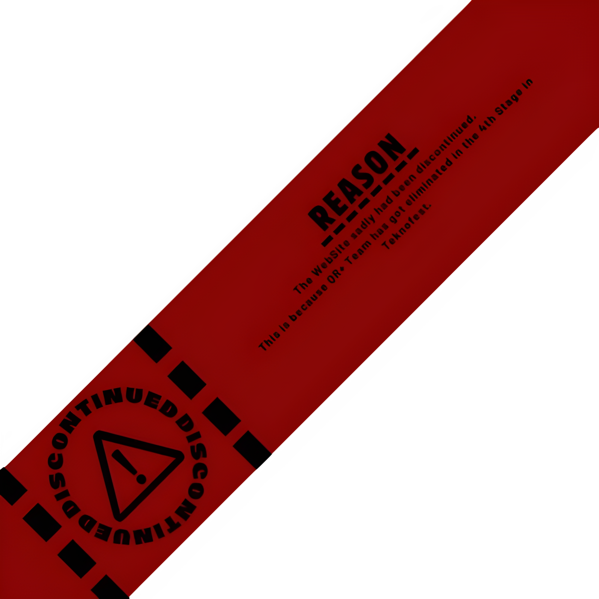

# Projects

[Main-Home](https://subfabula.github.io) | [TestGround](https://subfabula.github.io/SF_W/) | [Projects](https://subfabula.github.io/sf_Projects/)

---

## Welcome

Welcome to my Projects site!

In this place, I make Projects that I'm involved in, whether with a team or independently. While there may not be many projects at the moment, I hope to add more in the future.

---

## Latest Projects

### [**QR-Plus**](https://subfabula.github.io/QR-Plus/)

    
    

This _ was _ a Website for the QR+ Team, which _ were _ a team in Teknofest.
 

<!-- Placeholder for dynamically generated content -->

 Thank you for visiting! 

<!-- GitHub will automatically add your social links below this line -->
